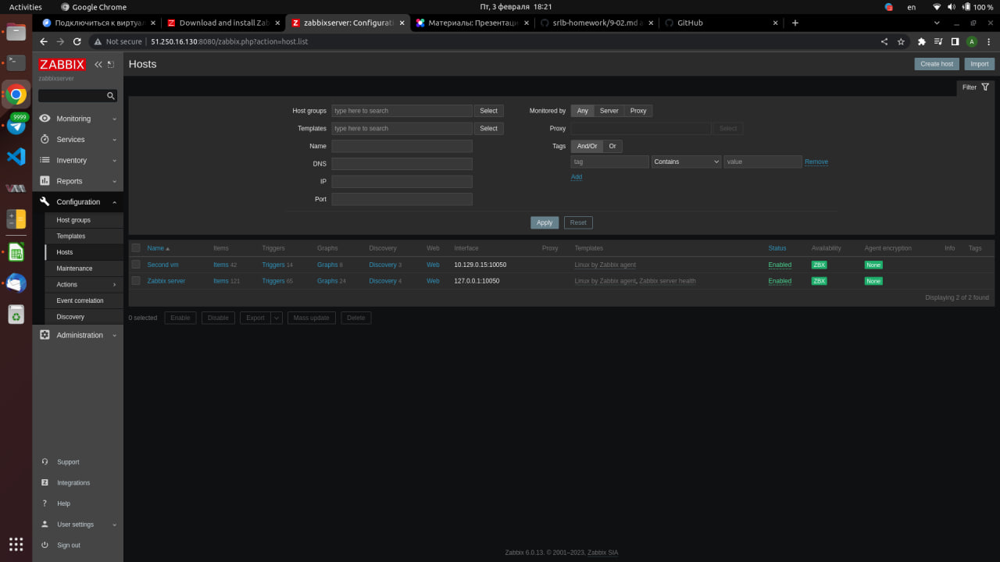
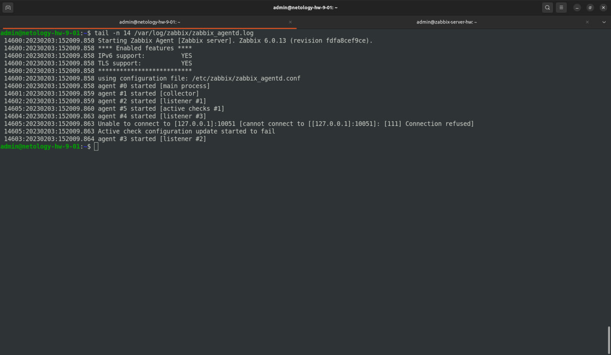
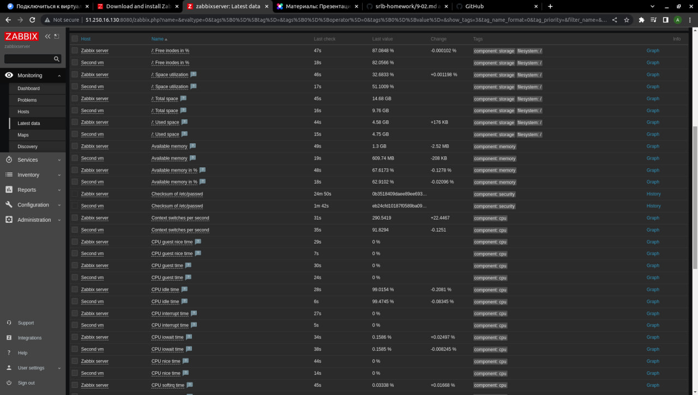
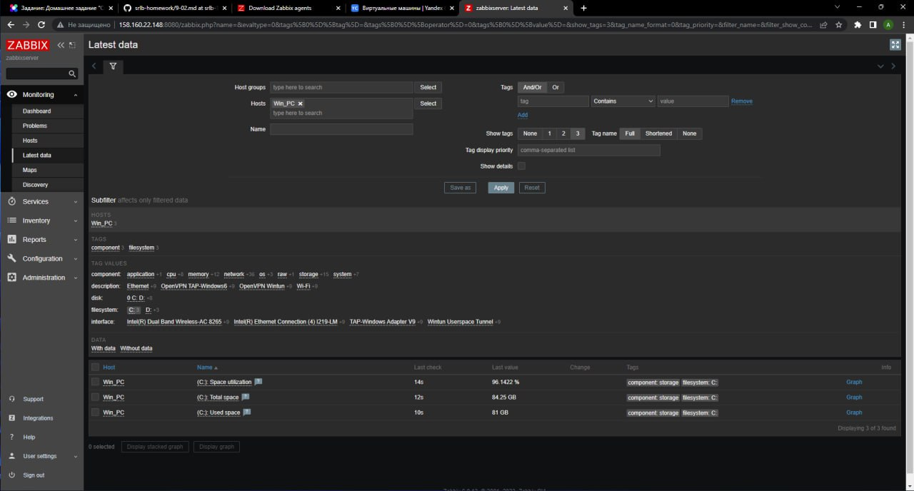

# Домашнее задание к занятию "9.2 Zabbix. Часть 1" - `Сотников Андрей`

---

### Задание 1

> Установите Zabbix Server с веб-интерфейсом.
>
> Приложите скриншот авторизации в админке. Приложите текст использованных команд в GitHub.


``` sh
wget https://repo.zabbix.com/zabbix/6.0/ubuntu/pool/main/z/zabbix-release/zabbix-release_6.0-4%2Bubuntu22.04_all.deb
sudo dpkg -i zabbix-release_6.0-4+ubuntu22.04_all.deb
sudo apt update
sudo apt install zabbix-server-pgsql zabbix-frontend-php php8.1-pgsql zabbix-nginx-conf zabbix-sql-scripts postgresql
sudo -u postgres createuser --pwprompt zabbix
sudo -u postgres createdb -O zabbix zabbix
zcat /usr/share/zabbix-sql-scripts/postgresql/server.sql.gz | sudo -u zabbix psql zabbix
sudo nano /etc/zabbix/zabbix_server.conf
sudo nano /etc/zabbix/nginx.conf
sudo systemctl restart zabbix-server zabbix-agent nginx php8.1-fpm
sudo systemctl enable zabbix-server zabbix-agent nginx php8.1-fpm
```

---

### Задание 2

> Установите Zabbix Agent на два хоста.
>
> Приложите скриншот раздела Configuration > Hosts, где видно, что агенты подключены к серверу. Приложите скриншот лога zabbix agent, где видно, что он работает с сервером. Приложите скриншот раздела Monitoring > Latest data для обоих хостов, где видны поступающие от агентов данные. Приложите текст использованных команд в GitHub.








``` sh
wget https://repo.zabbix.com/zabbix/6.0/ubuntu/pool/main/z/zabbix-release/zabbix-release_6.0-4%2Bubuntu22.04_all.deb
sudo dpkg -i zabbix-release_6.0-4+ubuntu22.04_all.deb
sudo apt update
sudo apt install zabbix-agent
sudo nano /etc/zabbix/zabbix_agentd.conf
sudo systemctl restart zabbix-agent
sudo systemctl enable zabbix-agent
```
---

### Задание 3*

> Установите Zabbix Agent на Windows (компьютер) и подключите его к серверу Zabbix.
>
> Приложите скриншот раздела Latest Data, где видно свободное место на диске C:

